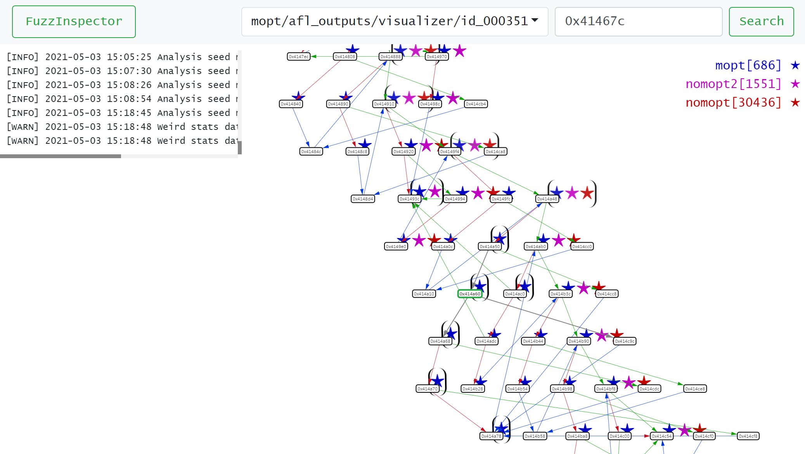

# FuzzInspector

FuzzInspector is a interactive visualization tool for fuzz testing.


## Installation

FuzzInspector use AFLplusplus, Qiling framework, and Radare2 to implement the interactive and visualization feature. Please make sure these tool are installed correctly.

We recommend to use [virtualenvwrapper](https://virtualenvwrapper.readthedocs.io/en/stable/install.html) to install the FuzzInspector. You can change the virtualenv name for youself. For example we use `fuzzinspector`.

```bash
mkvirtualenv -ppython3 fuzzinspector
# Pull submodules
git submodule init
git submodule update
# Install Radare2
sudo apt install radare2
# Install AFLplusplus
cd AFLplusplus
sudo apt install build-essential libtool-bin python3-dev automake flex bison libglib2.0-dev libpixman-1-dev clang python3-setuptools llvm
make distrib
cd ..
# Install Qiling
cd qiling
pip install .
cd ..
# Install FuzzInspector dependencies
pip install -r requirements.txt
```

## Usage

FuzzInspector provide the web interface. So specifying the port to web server (for example: 7788).

```bash
./mk_fuzzing_dir.sh 7788
cd fuzzinspector_7788
cp ql-example.py ql.py
# then modify the ql.py and make sure it can run your target
```

FuzzInspector can handle multiple fuzzer and visualize the fuzzing path. So you can prepare the multiple fuzzer to fuzz your target (now AFL++ only, but you can use different mode).

`cd fuzzer_name` to prepare fuzzer enviroment:

```bash
cd fuzzer_name
# modify the fuzz.sh for your target
# ex: Add -L for MOpt mode
# prepare the enviroment for your target
# ex: Copy target file (rootfs or binary) to here
```

You can copy `fuzzer_name` folder to create another fuzzing enviroment.
Note: The folder name will be used to identify the fuzzer by FuzzInspector. So giving a clearly name is helpful.

## Example

We provide a example to fuzz libexif.

Please execute:

```
./example/libexif.sh 7777
```

Then start the visualizer:

```
cd fuzzinspector_7777
workon fuzzinspector
./visrun.sh
```

Open the another terminal:

```
cd fuzzinspector_7777/fuzzer_name
./fuzz.sh
```

Visit `http://localhost:7777/?address=0x55555556322f` or other address you interested.

Note: We recommend you wait 5 hours or above before visiting the web page. Because there are so many seeds that need to be processed by qiling (the count of seeds are dependent on target). Let's hope someone speed up that.

## Contributing
Pull requests are welcome. For major changes, please open an issue first to discuss what you would like to change.

Please make sure to update tests as appropriate.

## License
[Apache License 2.0](https://choosealicense.com/licenses/apache-2.0/)
